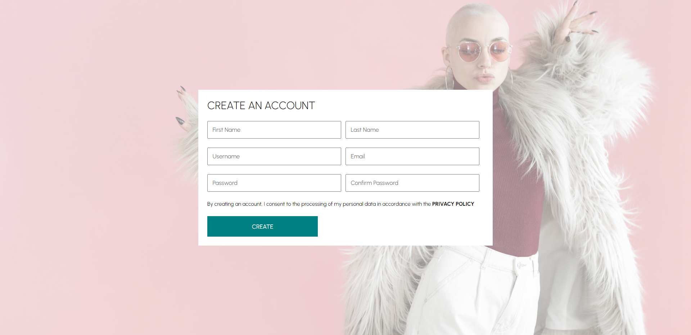
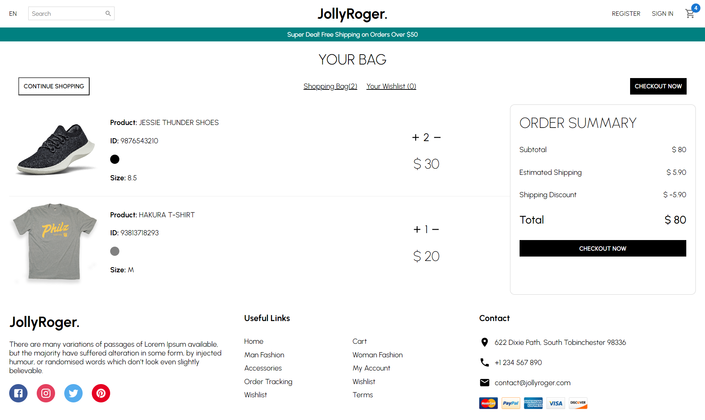

# E-Commerce UI - React E-Commerce Website


Welcome to the E-Commerce UI project! This is a front-end user interface built using React for an e-commerce website. The UI includes various pages such as the home page, product list page, product page, register page, login page, and cart page. The goal of this project is to provide users with an interactive and user-friendly shopping experience.

## Table of Contents

- [Introduction](#e-commerce-ui---react-e-commerce-website)
- [Features](#features)
- [Screenshots](#screenshots)
- [Installation](#installation)
- [Usage](#usage)
- [Contributing](#contributing)

## Features

- **Home Page:** Displays featured products and promotions to engage users.
- **Product List Page:** Lists various products available for purchase.
- **Product Page:** Provides detailed information about a selected product.
- **Register Page:** Allows users to create an account for shopping.
- **Login Page:** Enables users to log in to their accounts.
- **Cart Page:** Displays selected products and allows users to manage their cart.

## Screenshots


_Home Page_


_Product List Page_


_Product Page_


_Register Page_


_Login Page_


_Cart Page_

## Installation

1. Clone the repository using the following command:

   ```bash
   git clone https://github.com/sadanmian/E-Commerce.git
   ```

2. Navigate to the project directory:

   ```bash
   cd E-Commerce
   ```

3. Install the required dependencies:

   ```bash
   npm install
   ```

## Usage

1. Start the development server:

   ```bash
   npm start
   ```

   This will launch the website in your default web browser. You can access it at `http://localhost:3000`.

2. Navigate through the different pages using the navigation links provided.

3. Register an account or log in to start exploring and shopping.

4. Browse products, view product details, add items to your cart, and manage your cart.

## Contributing

Contributions are welcome! If you'd like to contribute to this project, please follow these steps:

1. Fork the repository.
2. Create a new branch for your feature or bug fix.
3. Make your changes and test them thoroughly.
4. Commit your changes with clear and concise commit messages.
5. Push your changes to your forked repository.
6. Create a pull request explaining your changes and their purpose.
